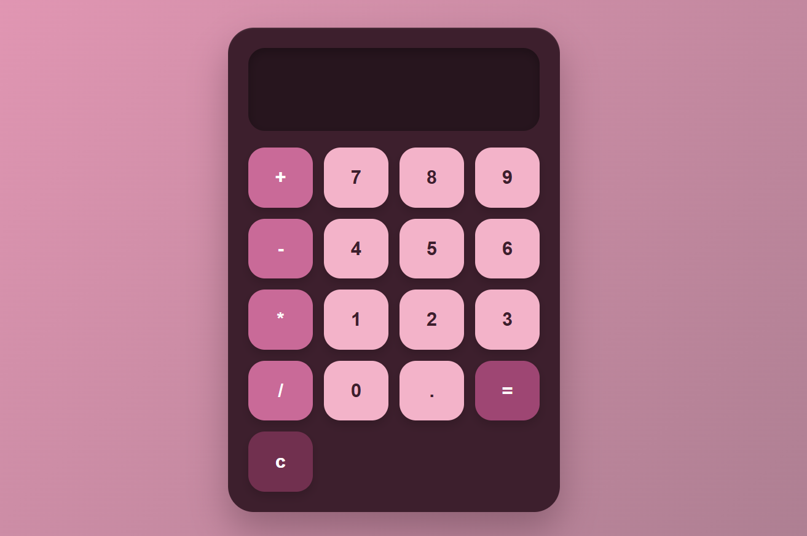
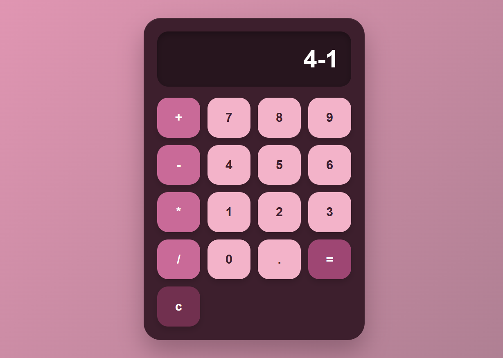
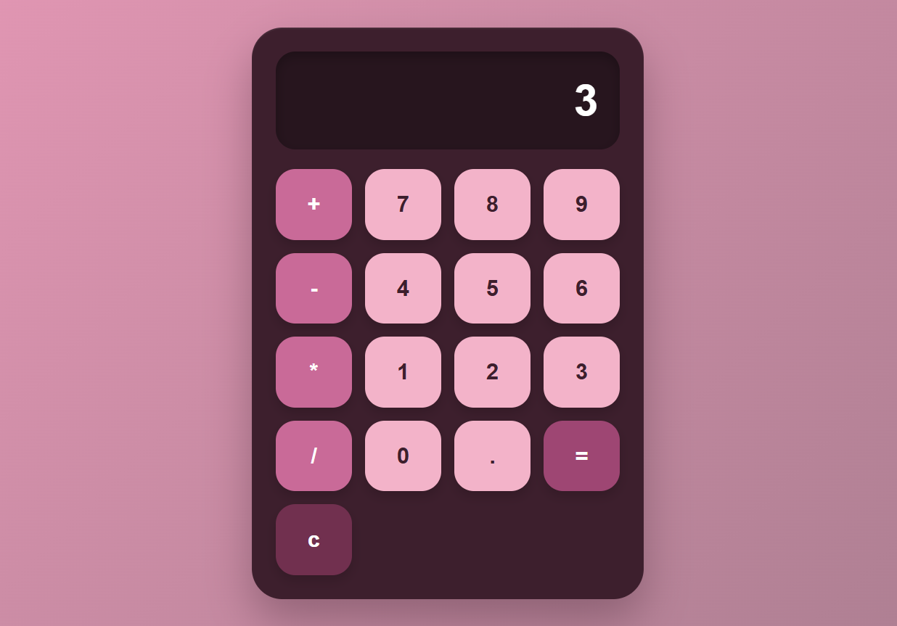

# 🧮 Calculator
A very simple, responsive calculator web app built with HTML, CSS, and JavaScript — featuring a sleek dark cyberpunk-inspired UI with neon magenta and cyan accents.
## ✨ Features
- Basic arithmetic operations: addition, subtraction, multiplication, division
- Clear (C) and delete (DEL) functionality
- Responsive design — works on mobile and desktop
- Keyboard input support
## 📸 Screenshots

<table>
  <tr>
    <td></td>
    <td></td>
    <td></td>
  </tr>
</table>

## 🛠️ Tech Stack
- **HTML5** — structure
- **CSS3** — styling and animations
- **JavaScript (Vanilla)** — logic and DOM manipulation
## 📂 Project Structure
```
calculator/
├── index.html
├── style.css
├── script.js
└── README.md
```
## ⚙️ Installation & Usage
1. Clone the repository
   ```bash
   git clone https://github.com/AtibaYounus/calculator.git
   ```
2. Navigate into the project folder
   ```bash
   cd calculator
   ```
3. Open `index.html` in your browser — no build steps or dependencies required
## 🧑‍💻 Author
**Atiba Younus**
- GitHub: [@AtibaYounus](https://github.com/AtibaYounus)
## 📄 License
This project is open source and available under the [MIT License](LICENSE). add photos to reADME and update
